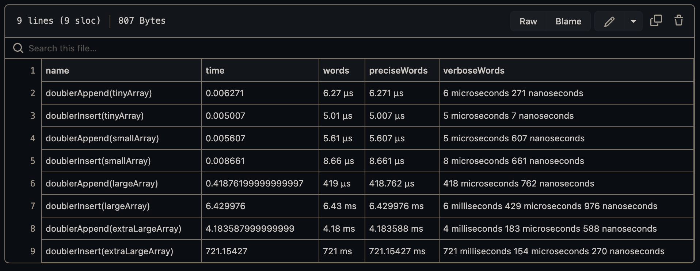

# In Javascript, which scales better, insert() or append()? 

  
> (above) Results of runtime analysis between doublerAppend() and doublerInsert().

When analyzing the runtime of doublerInsert() and doubleAppend() given the same parameters, doublerAppend() is the clear winner. The results indicate that on the first iteration, doublerInsert() is the faster of the two, but on subsequent iterations, doublerInsert() is slower. The scaling of doublerInsert() when given more workload is sub par when compared to doublerAppend(), this is demonstrable once both methods encounter the 'largeArray' parameter. The runtime for doublerAppend(largeArray) is 418 microseconds while the runtime for the doublerInsert(largeArray) is 6 milliseconds, this pattern presents itself again once the methods encounter the 'extraLarge' array where the difference between is 717 milliseconds. When dealing with the 'smallArray', the difference was 3 microseconds in favor of doublerAppend(), not a huge difference and in fact doublerInsert() beat doublerAppend() with the 'tinyArray'. This demonstrates that under small workloads both methods perform similarly, but once the workload increases and the methods perform at scale, their run times become divergent.  

Why would these methods that achieve the same result perform differently at scale?
Both functions add an element to an array. One function accomplishes this with the .push() method, while the other utilizes the .unshift() method. The difference in performance is cause by how each method performs it's task. The .push() method returns the last element of an array and appends the new element after the last element. The .unshift() method moves the entire array up one index and places the new element at the first array index. The process of .unshift() shifting the array requires more work, and as the array size increases, so does the time to do that work.

The conclusion I present is runtime analysis can present a software developer with an understanding of which functions are performant and how functions and methods compare when presented with a benchmark workload.
